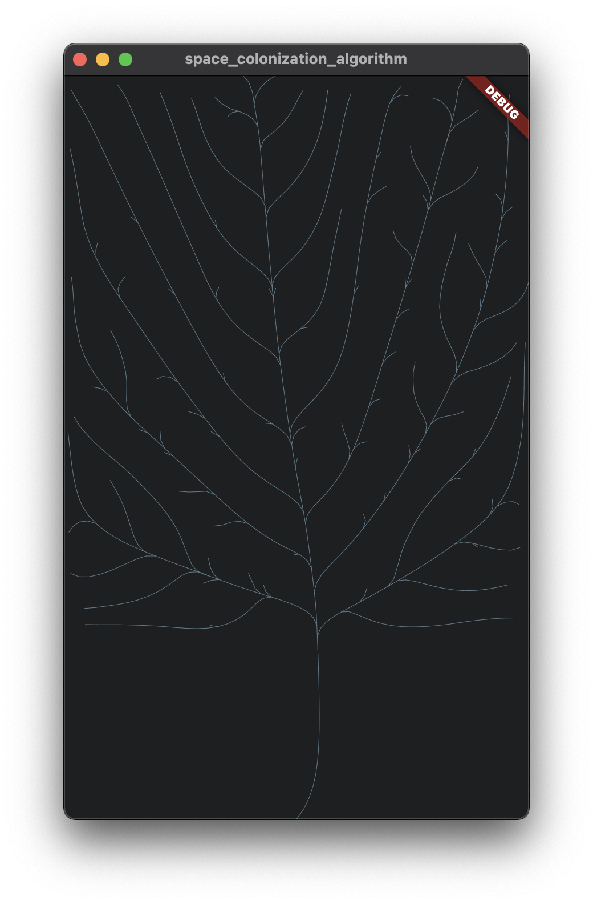

# Flutter (dart) implementation of Space Colonization Algorithm  

A primitive implementation of the Space Colonization Algorithm http://algorithmicbotany.org/papers/colonization.egwnp2007.pdf

An example of the result of program execution

In addition to the original algorithm proposed by its authors, the parameter "persistence" was added. It determines how bendable the newly created piece of the tree branch is.
